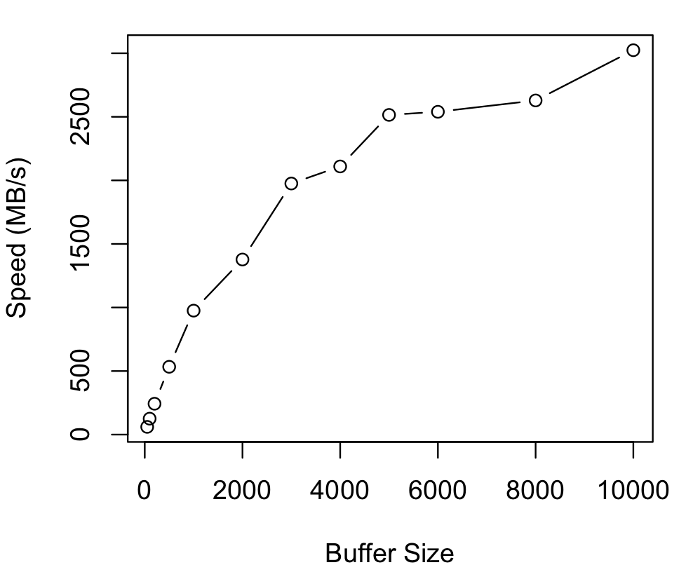

# pcap-filter
Experiments in PCAP file decoding at speed

The basic idea is the ordinary PCAP decoders available in Java give away boatloads 
of speed by very bad I/O patterns and creation of too many objects.
 
It is much more efficient to read a ton of data into memory and then "parse" it
without moving anything. Any characteristic of packets that you want can be 
interrogated directly from the bytes in question on demand which increases speed
further by avoiding the decoding of data that just gets thrown away.

The tests in this project are really demonstration programs that show how much 
difference this can make.

## Just how fast is it?

Well, if you don't have just less than a minute to run the tests, here is what I 
get on my laptop:

    Speed test for per packet object
        Read 859.7 MB in 15.03 s for 57.2 MB/s
        8772352 packets, 8772352 TCP packets, 0 UDP

    Speed test for in-place packet decoding
        Read 859.7 MB in 0.50 s for 1714.3 MB/s
        8772308 packets, 8772308 TCP packets, 0 UDP

The data here is in cache, not on disk. Since we want to see how fast this can go 
without worrying about extraneous bottlenecks, this is good.
 
The short answer is that decoding packages in a sensible way is about 30x faster.

You may note that the output above shows fewer packets for the faster parser. That
happens because I didn't think it was worth going to the trouble of parsing the last
partial buffer full of data. It isn't hard to fix this.

I think, by the way, that this speedup can be explained to a large extent by better I/O
patterns. Here are results from a different test that reads a GB using different size
reads:

| Read size | Total size | Time | Speed |
| ---------: | ---------- | ----: | -----: |
| 50| 1000.0 MB | 15.8 s: | 63.1 MB/s |
| 100| 1000.0 MB | 7.9 s | 127.2 MB/s |
| 200| 1000.0 MB | 4.2 s | 240.8 MB/s |
| 500| 1000.0 MB | 1.8 s | 546.3 MB/s |
| 1000| 1000.0 MB | 1.0 s | 985.9 MB/s |
| 10000| 1000.0 MB | 0.4 s | 2519.4 MB/s |

That looks like this with a bit more resolution on it:

